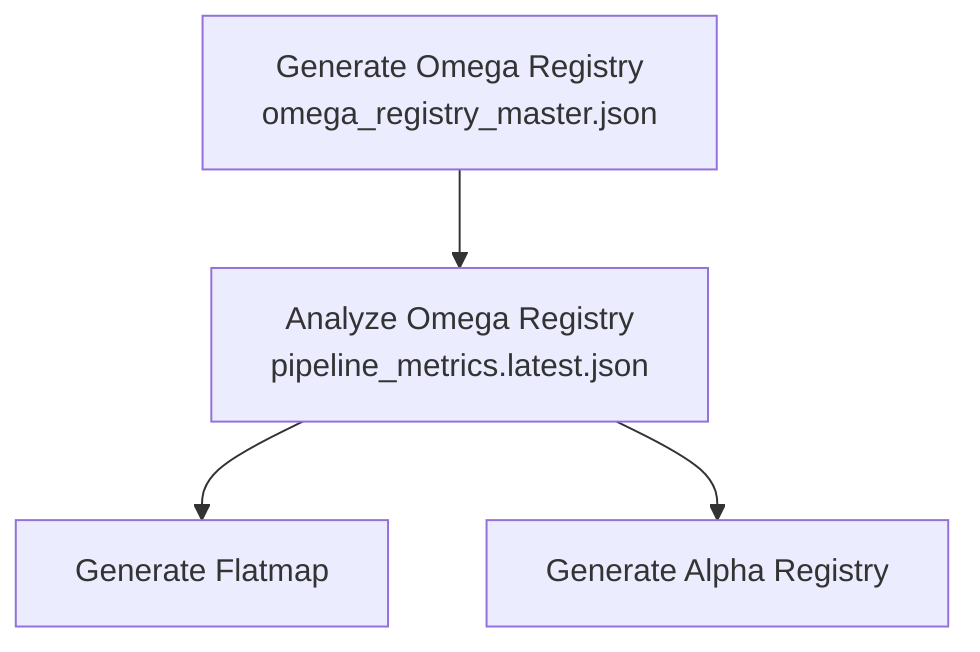

# Omega Registry Pipeline Scripts

---

**Canonical Output Notice:**

- `omega_registry_master.json` is the only canonical registry output for the Omega Registry pipeline. All validation, analytics, diagnostics, audits, and post-processing scripts must operate on this file only.
- All references to `omega_registry.enriched.v1.json`, `generate_omega_registry.py`, and alternate outputs are deprecated unless explicitly qualified as archival or reference material under `registry_alias/`.
- Pretty-printed versions (e.g., `omega_registry_master.pretty.json`) are strictly for human readability and not for programmatic use.
- Legacy scripts and outputs are deprecated; see `scripts/legacy/README.md` for details.
- All contract and manifest references must point only to canonical pipeline artifacts.
- **[2025-07-31] Patch Notice:** All pipeline scripts, including `enrichment_engine.py`, are now safe for import: CLI argument parsing and path setup are only executed under `if __name__ == "__main__":`. This prevents argparse errors and allows safe composition/import in the canonical pipeline. All new scripts must follow this pattern for import safety.

## Pipeline Flowchart (Visual Overview)

> **Tip:** For best results, use a Mermaid-enabled Markdown preview extension in VS Code to view the diagram clearly.

```mermaid
flowchart TD
    %% Mandatory step: omega registry generation from canonical inputs
    c1[omega_pipeline_main.py - Generators]

    %% Canonical registry inputs
    i1[core.entity_registry]
    i2[core.device_registry]
    i3[core.area_registry]
    i4[core.floor_registry]
    i5[core.config_entries]
    i6[core.restore_state]
    i7[homeassistant.exposed_entities]
    %% Add more as needed from contract

    %% Optional scripts: enrichment/analytics
    d1((generate_entity_flatmap.py - Diagnostics))
    d2((flatten_device_registry.py - Diagnostics))
    d3((generate_flatmap.py - Generators))
    a1((generate_alpha_room_registry.py - Diagnostics))
    a2((generate_alpha_registry.py - Generators))
    a3((sanitize_alpha_room_registry.py - Generators))
    e1((finalize_alpha_room_registry.py - Analytics))
    e2((repair_alpha_room_registry.py - Analytics))
    e3((build_enriched_device_map.py - Transformation))
    e4((crossref.py - Transformation))
    e5((omega_enrichment_metadata.py - Transformation))
    e6((refine_enriched_device_registry.py - Transformation))
    e7((hestia_pre_reboot_parser.py - Transformation))
    e8((analyze_omega_registry.py - Analytics))

    %% Main pipeline flow
    i1 --> c1
    i2 --> c1
    i3 --> c1
    i4 --> c1
    i5 --> c1
    i6 --> c1
    i7 --> c1

    %% Optional branches (enrichment/analytics)
    d1 -.-> c1
    d2 -.-> c1
    d3 -.-> c1
    a1 -.-> c1
    a2 -.-> c1
    a3 -.-> c1
    e1 -.-> a1
    e2 -.-> a1
    e3 -.-> c1
    e4 -.-> c1
    e5 -.-> c1
    e6 -.-> c1
    e7 -.-> c1
    e8 -.-> c1
```



*The omega registry is generated directly from canonical registry input files. All other scripts are optional enrichment, analytics, or transformation steps. Dashed arrows indicate optional branches.*

---

## Pipeline Overview

The pipeline processes Home Assistant and Hestia registry inputs, applies enrichment and transformation logic, and produces canonical, tiered, and validated registry outputs. Each stage is implemented as a script, with clear input/output contracts and logs for traceability.

---

## Minimum Viable Pipeline (Required Step)

To produce the canonical omega registry output, you only need to run:

- `omega_pipeline_main.py` (Generators) — Builds the canonical omega master registry from all core inputs and configs. **Required**

This script consumes the canonical registry input files in `canonical/registry_inputs/` as defined by the contract. All other scripts are optional and provide enrichment, validation, analytics, or audit capabilities.

---

## Optional/Uplift Scripts (Enhancements & Enrichment)

The following scripts are not strictly required for the minimum viable output, but provide significant benefits:

- **Diagnostics & Flatmap Generation**
  - `generate_entity_flatmap.py` (Diagnostics)
  - `flatten_device_registry.py` (Diagnostics)
  - `generate_flatmap.py` (Generators)

- **Alpha Registry Construction & Validation**
  - `generate_alpha_room_registry.py` (Diagnostics)
  - `generate_alpha_registry.py` (Generators)
  - `sanitize_alpha_room_registry.py` (Generators)
  - `finalize_alpha_room_registry.py` (Analytics)
  - `repair_alpha_room_registry.py` (Analytics)

- **Enrichment & Transformation**
  - `build_enriched_device_map.py` (Transformation)
  - `crossref.py` (Transformation)
  - `omega_enrichment_metadata.py` (Transformation)
  - `refine_enriched_device_registry.py` (Transformation)
  - `hestia_pre_reboot_parser.py` (Transformation)

- **Analytics & Audit**
  - `analyze_omega_registry.py` (Analytics)
  - All scripts emit logs and metrics to the `logs/` folder for traceability and debugging.

---

## How to Run the Pipeline

1. Place all required registry input files in the `canonical/registry_inputs/` folder.
2. Run the mandatory scripts in the order described above to produce the minimum viable output.
3. Optionally, run uplift/enrichment scripts for enhanced outputs and analytics.
4. Validate outputs against contracts in `support/contracts/`.
5. Review logs and metrics in `canonical/logs/` for audit and debugging.

---

## Script Groups

- **Analytics:** Analysis, validation, metrics extraction.
- **Diagnostics:** Extraction, flattening, validation.
- **Generators:** Registry construction, sanitization.
- **Transformation:** Enrichment, cross-referencing, parsing.
- **Utils:** Shared logic, contract enforcement, validation helpers.

Each script is documented in this manifest with its input/output files and role in the pipeline.

For more details, see the individual script docstrings and the project manifest.

---

## Script Input/Output Specification

### generate_alpha_registry.py

- **Inputs:**
  - `canonical/omega_registry_master.json` (room data)
  - `canonical/registry_inputs/core.floor_registry` (floor data)
  - `canonical/registry_inputs/core.area_registry` (area data)
  - `canonical/logs/analytics/pipeline_metrics.latest.json` (tier analytics)
  - `canonical/registry_inputs/core.entity_registry` (entity data)
  - `canonical/support/contracts/join_contract.yaml` (reference format)
- **Output:**
  - `canonical/derived_views/alpha_room_registry.v1.json` (contract-compliant alpha room registry)

### generate_flatmap.py

- **Inputs:**
  - For entity flatmap:
    - `canonical/registry_inputs/core.entity_registry` (entity registry)
    - `canonical/support/contracts/join_contract.yaml` (reference format)
  - For device flatmap:
    - `canonical/registry_inputs/core.device_registry` (device registry)
    - `canonical/support/contracts/join_contract.yaml` (reference format)
- **Outputs:**
  - For entity flatmap:
    - `canonical/derived_views/flatmaps/entity_flatmap.json` (entity flatmap)
    - `canonical/logs/analytics/entity_flatmap.metrics.json` (entity flatmap metrics)
  - For device flatmap:
    - `canonical/derived_views/flatmaps/device_flatmap.json` (device flatmap)
    - `canonical/logs/analytics/device_flatmap.metrics.json` (device flatmap metrics)

### sanitize_alpha_room_registry.py

- **Inputs:**
  - `canonical/derived_views/flatmaps/entity_flatmap.json` (entity flatmap)
  - `canonical/logs/analytics/pipeline_metrics.latest.json` (tier analytics)
  - `canonical/support/contracts/join_contract.yaml` (reference format, provenance)
  - `canonical/support/contracts/alpha_room_registry.output_contract.yaml` (output contract, cluster threshold)
  - `canonical/support/contracts/area_hierarchy.yaml` (area hierarchy)
- **Outputs:**
  - `canonical/derived_views/alpha_room_registry.sanitized.v1.json` (sanitized alpha room registry)
  - `canonical/logs/audit/alpha_room_registry_sanitization.log` (summary log)
  - `canonical/logs/scratch/PATCH-CONTRACT-CANONICALIATION-V1.log` (audit log)

---

## PATCH PIPELINE-TRACE-FLAGS-V1: Pipeline sequence and flags updated for lineage tracking

### Updated Pipeline Sequence

1. **Generate Omega Registry**
   - Script: `omega_pipeline_main.py`
   - Output: `canonical/omega_registry_master.json`
   - Pipeline flag: `omega_registry_generation`

2. **Analyze Omega Registry**
   - Script: `analyze_omega_registry.py`
   - Output: `canonical/logs/analytics/pipeline_metrics.latest.json` (always emitted)
   - Pipeline flag: `omega_registry_analytics`
   - SHA256 provenance included

3. **Flatmap & Alpha Registry Generation**
   - Scripts: `generate_flatmap.py`, `generate_alpha_registry.py`
   - Inputs: `pipeline_metrics.latest.json` (required)
   - Pipeline flags: `flatmap_generation`, `alpha_registry_generation`
   - Can be run in parallel or sequence (see script requirements)

### Mermaid Diagram (Updated)



*All pipeline stages emit lineage flags in their _meta blocks for traceability.*

---

## 🚀 Latest Pipeline Integration: Automated Analytics Step

**[2025-08-02] Patch Notice:**

- The main pipeline script (`omega_pipeline_main.py`) now supports a `--with-analytics` flag.
- When this flag is set, the analytics script (`analyze_omega_registry.py`) is automatically executed as a post-processing step after successful registry output generation.
- Analytics always operate on the canonical output (`omega_registry_master.audit.json` if present, else `omega_registry_master.json`).
- Analytics output is written to `canonical/logs/analytics/analyze_omega_registry.latest.json` and `pipeline_metrics.latest.json`.
- All analytics logs and metrics are available in the `canonical/logs/analytics/` directory.
- The pipeline logs analytics execution and any errors, but analytics failures do not block registry generation.

### Usage Example

```sh
python3 scripts/omega_pipeline_main.py --output-profile audit --with-analytics
```

- This will generate the canonical registry and immediately run analytics, producing all metrics and audit outputs in one step.
- Omit `--with-analytics` to skip analytics post-processing.
